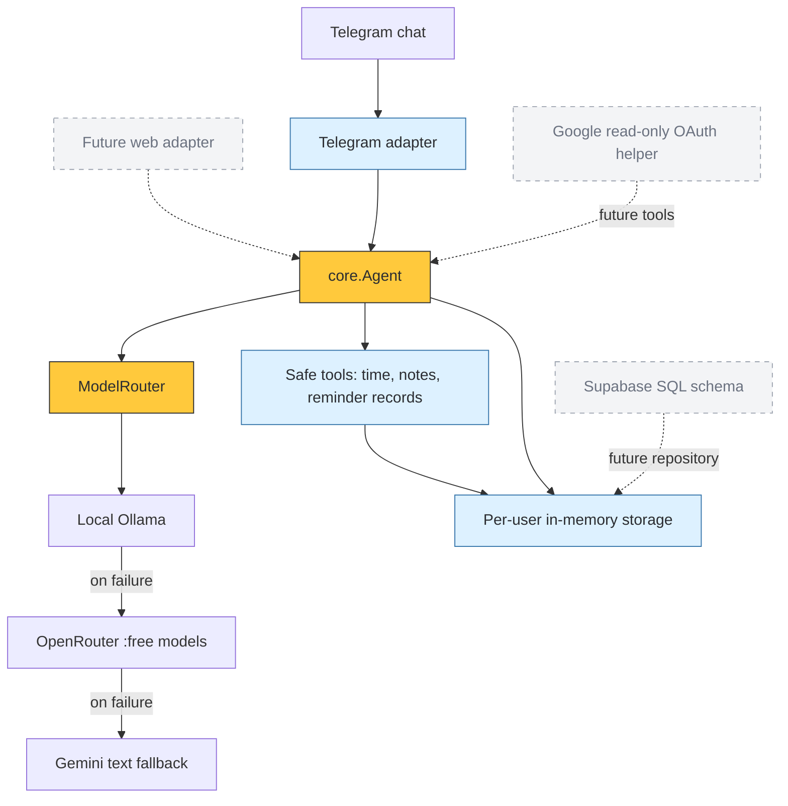

<div align="center">

# 🖍️ Crayon v1


**A Python personal-assistant prototype for Telegram.**


[Quick start](#-quick-start) · [Architecture](#-architecture) · [Boundaries](#-know-the-boundaries) · [Roadmap](#-next-on-the-page)

</div>

---

## 🟡 Small core, clear pieces

Crayon separates the conversation core from the Telegram interface. It tries local Ollama first, then configured OpenRouter `:free` models, then Gemini. Notes and conversation history are kept per user in memory.

| Piece | What exists today |
| :--- | :--- |
| Telegram | `/start`, `/help`, `/delete_my_data`, text replies and approval-button scaffolding |
| Agent | Conversation history, safe-tool dispatch and a configurable tool-loop budget |
| Tools | Time lookup, notes and reminder records |
| Models | Ollama → OpenRouter free-model rotation → Gemini fallback |
| Memory | Per-user, process-local memory; Supabase SQL schema is included but not wired in |
| Google | OAuth helper with Calendar/Gmail read-only scopes; live routes are incomplete |
| Web | Adapter placeholder for a future interface |

> [!IMPORTANT]
> This is a prototype, not a finished hosted assistant. Reminders are recorded, not delivered by a scheduler. Google reads, persistent storage and external writes are not ready. Gemini's current adapter is text-only and does not return tool calls.

## 🟢 Quick start

**For basic Telegram chat, you need a bot token and one working model backend.** Supabase and Google OAuth are optional future-integration setup, not requirements for basic chat.

```bash
git clone https://github.com/itsppm76/crayon.git
cd crayon
python3 -m venv .venv
source .venv/bin/activate
pip install -r requirements.txt
cp .env.example .env
```

Edit your local `.env`, then run:

```bash
python main.py
```

| Step | What to configure |
| :--- | :--- |
| 1 · Telegram | In `@BotFather`, send `/newbot`, choose a name and a username ending in `bot`. Put the token in `TELEGRAM_BOT_TOKEN`. |
| 2 · Local model | If using Ollama, install it and pull the configured model. The example uses `gemma4:e4b`; check availability and set `OLLAMA_MODEL` to an installed model. |
| 3 · API fallback | Set `OPENROUTER_API_KEY` plus `OPENROUTER_MODELS` containing only `:free` IDs, or set `GEMINI_API_KEY` from AI Studio. |
| 4 · Start | Run `python main.py`, open your bot in Telegram, and send a message. Long polling lasts only while this process runs. |

> [!NOTE]
> The Gemini adapter currently hardcodes `gemini-2.0-flash`. A valid API key alone does not prove that model is available for your project. Backend availability and quotas must be checked live. The router still attempts Ollama first when using an API fallback.

Keep `.env`, tokens and Google client JSON out of git. `.gitignore` already covers `.env` and `config/google_client_secret.json`. Never put a service-role key in a browser or Telegram.

### Optional integration groundwork

<details>
<summary><strong>Supabase and Google OAuth</strong></summary>

**Supabase:** create one project, run [`db/schema.sql`](db/schema.sql), and set `SUPABASE_URL`, `SUPABASE_SERVICE_ROLE_KEY` and `TOKEN_ENCRYPTION_KEY` server-side. A repository adapter still needs to be built; setting these variables does not enable persistence.

**Google:** create a Desktop OAuth client, enable Gmail and Calendar APIs, and add yourself as a test user while the consent screen is in testing mode. Save client JSON to `config/google_client_secret.json`. [`core/google_oauth.py`](core/google_oauth.py) requests only `calendar.readonly` and `gmail.readonly`. `/connect`, callbacks, reads and token storage still need wiring and live tests.

</details>

### Colab

Open [`notebooks/crayon_v1.ipynb`](notebooks/crayon_v1.ipynb), replace the notebook's clone URL with `https://github.com/itsppm76/crayon.git`, add credentials in Colab Secrets, and run cells top-to-bottom. Runtime disconnects stop the bot; in-memory data is lost on restart.

## 🔵 Architecture



Solid lines are implemented paths. Dotted lines are unfinished integration work. A backend is skipped if its API key is absent; all backends failing raises an error.

## 🟠 Test the core

```bash
pytest -q
```

**6 tests passed in the local setup check on October 7, 2026.** This badge is a recorded offline result, not a CI status. Tests mock model responses; they do not prove live Telegram, Ollama, OpenRouter, Gemini, Google or Supabase connectivity.

See [`TEST_CHECKLIST.md`](TEST_CHECKLIST.md) and [`KNOWN_LIMITATIONS.md`](KNOWN_LIMITATIONS.md) before treating the bot as ready for everyday use.

## 🔴 Know the boundaries

- Memory is per user, but disappears when the process stops.
- The Telegram adapter handles model calls synchronously and has no custom backend-error reply handler.
- The system prompt treats outside text as data and forbids external writes. This is a policy prompt, not a proof against malicious input.
- Approval buttons are scaffolding. They acknowledge approval but intentionally do not send mail, create events or contact others.
- Google OAuth asks for read-only scopes; actual Calendar/Gmail tools are unfinished.
- Free models and free hosts have limits. Reliable always-on hosting and usage beyond free tiers may cost money.
- The tool-loop budget needs stricter dispatch enforcement, rate limits and audit logs before production use.

## 🟣 Next on the page

From [`ROADMAP.md`](ROADMAP.md):

- [ ] Supabase repository, encrypted tokens and RLS tests
- [ ] OAuth callback and live read-only Gmail/Calendar tools
- [ ] Durable reminder scheduler and optional morning summaries
- [ ] Tool parsing, rate limits, audit log and strict five-call enforcement
- [ ] Draft objects and approval replay protection before any scoped writes
- [ ] Always-on long-polling host with a working model fallback
- [ ] Web adapter sharing the same conversation core

## ⚪ License

MIT © 2026 Crayon contributors. Read [`LICENSE`](LICENSE).

<div align="center">

**Crayon Yellow `#FFC93C` · Charcoal `#2B2D31` · Slate `#6B7280`**

Small assistant. Honest status. Room to grow.

</div>
