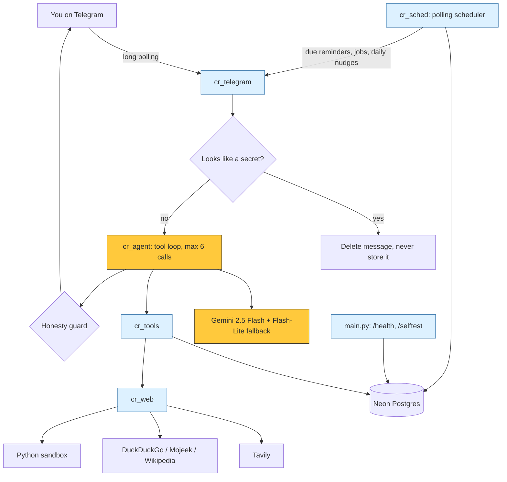

<div align="center">

# 🖍️ Crayon v1


**A personal assistant on Telegram with persistent memory, live web search, sandboxed code, reminders, tracked tasks and honest safety rails. Runs entirely on free tiers.**


[**Try the bot**](https://t.me/crayon_v1_bot) · [Features](#-what-crayon-can-do) · [Architecture](#-architecture) · [Safety](#-safety-rails) · [Endpoints](#-endpoints) · [Setup](#-setup) · [Limits](#-honest-limits)

</div>

---

## ✅ Tonight's release: v2.28.0

117 local tests pass. Deployed bot: [@crayon_v1_bot](https://t.me/crayon_v1_bot). Feature availability is separate from proof: code-tested features are not marked as live user tests.

### Who gets what

| Access tier | Available features | Limits |
| :--- | :--- | :--- |
| Everyone using the bot | Chat, personal memory/review/forget/wipe, notes, reminders, tracked tasks, goal plans, web search/page reading, bounded research, sandboxed maths, currency/unit conversion, CSV/charts, review-only message drafts, opt-in digests/nudges and quiet hours | Each person's private data stays separate. Free-host timing and model output are best-effort. |
| Named Google test users who connect their own account | Gmail/calendar reads, encrypted reviewed email Send/Cancel, private primary-calendar preview/Cancel | Google OAuth is still in testing mode, not open to arbitrary accounts. Each user needs their own personal connection link. Calendar Create needs optional write-scope reconnect and an approved live test. |
| Owner + approved computer testers | Computer status, arithmetic, public HTTPS browser screenshots; fixed World Bank research-to-chart demo | 5 execution jobs/tester/day, 20 owner/day, 30 total/day, failures included. Shared free machine must be awake. Tester access code-tested; another person's live test still pending. |
| Owner only | Text-file create/read on the computer; lifecycle/setup controls; opt-in hourly email-watch beta | Mail watch is OFF and scheduled delivery is not yet live-proven. Owner files are not shared with testers. |

### Live checks and UX

- Public screenshots of the Python tutorial, Instagram login wall and signed-out YouTube were delivered and visually checked. This is public-site reading, not a general website operator.
- The fixed World Bank 2024 GDP-per-capita demo returns checked India/China/US records, source screenshot, CSV, chart, findings and work log. Not arbitrary research automation.
- Owner computer status, arithmetic and text-file create/read passed live tests.
- Google mail/calendar reads, owner-reviewed email send, and calendar preview/Cancel passed live checks. No calendar event write claimed.
- Group exact-tag replies and untagged-ignore passed live tests; add-welcome still needs a real add test.
- 17-command Telegram menu, plain-text replies, reactions and progress messages are deployed.
- PNG screenshots/charts use Telegram `sendPhoto` within photo dimensions; CSVs stay documents. Existing artifact limit is 2MB. Photo-card delivery and rendered in-chat screenshot pixels were verified live.

### Still coming / not active

| Feature | Exact status |
| :--- | :--- |
| Automatic computer wake | Disabled module deployed. GitHub lifecycle-token creation blocked; execution/scheduler integration, worker startup hook and live wake/idle-stop proof still required. Not shipped. |
| Hourly email watch | Deployed owner-only opt-in beta, OFF. Bounded sender/subject/provider-snippet excerpts, quiet hours, no bodies or Gemini processing. Scheduled delivery still needs a live check. |
| Calendar Create | Deployed, awaiting optional Google write-scope reconnect and exact owner-approved live Create. Private primary calendar only, no attendees/invitations/Meet. |
| Group welcome / other-user computer proof | Code-tested; real group-add and tester-chat checks pending. |
| Public form/booking interaction | Roadmap only. No forms, logins, commerce or payments implemented. |

Safety remains: review before sends/writes, secret interception/redaction, per-user isolation, bounded jobs/tools/reads, untrusted-page handling, public-IP and sensitive-portal checks. Google mail/calendar results bypass Gemini. $0 budget guard unchanged; no payment initiated.

## 🟡 What Crayon can do

Crayon lives in a Telegram chat at [`@crayon_v1_bot`](https://t.me/crayon_v1_bot), hosted at <https://crayon-v1.onrender.com/>. The core capabilities below are deployed; release notes above separate live checks from inactive and code-tested features.

| # | Capability | What it means in practice |
| :-: | :--- | :--- |
| 1 | 🧠 **Persistent memory** | Facts, preferences and projects are stored in Neon Postgres and recalled across chats and restarts. See and edit them with `/memory` and `/forget`. |
| 2 | 🔎 **Web search** | Current information through the Tavily API, with DuckDuckGo, Mojeek and Wikipedia as fallbacks. Can also open a public page and read its text. |
| 3 | 🧪 **Sandboxed code execution** | Exact math and data checks run in a Python sandbox with no internet, files or access to your data. |
| 4 | ⏰ **Reminders and scheduled jobs** | One-off or recurring reminders, plus self-running jobs that fire a prompt on schedule. Delivered by an in-process polling scheduler. |
| 5 | 📋 **Multi-day tracked tasks** | Tasks with subtasks and per-step status (`todo`, `doing`, `done`, `blocked`). Progress is injected into the conversation, and a daily check-in nudge follows up on open tasks. |
| 6 | 🛡️ **Safety rails** | Confirmation before irreversible actions, automatic deletion of messages that look like secrets, and an honesty guard that blocks unbacked "done" claims. |
| 7 | 🩺 **`/health` and `/selftest`** | A public health check and a token-protected end-to-end self test. |

### Chat commands

| Command | Does |
| :--- | :--- |
| `/start` | Greets you and registers your profile |
| `/help` | Lists what Crayon understands |
| `/memory` | Shows everything Crayon remembers about you |
| `/forget <key>` | Removes one remembered fact, then checks it is gone |
| `/delete_my_data confirm` | Permanently deletes your memory, notes, reminders and chat history |

Everything else is natural language: "remind me tomorrow at 9 to call the bank", "track my passport renewal as a task", "what's the latest on ...".

### Tools the model can call

| Group | Tools |
| :--- | :--- |
| Memory and notes | `remember`, `forget`, `save_note`, `list_notes` |
| Time and reminders | `get_time`, `set_reminder`, `schedule_job`, `list_reminders`, `cancel_reminder` |
| Tracked tasks | `create_task`, `list_tasks`, `update_step`, `close_task` |
| Web and compute | `web_search`, `read_url`, `run_python` |

Each tool is tagged with a risk level (safe, write or dangerous). Dangerous ones, such as `forget`, require an explicit YES first.

---

## 🔵 Architecture



### Stack

| Layer | Choice | Cost |
| :--- | :--- | :--- |
| Interface | Telegram Bot API, long polling | Free |
| Hosting | Render web service (free tier) | Free |
| Database | Neon Postgres (free tier) | Free |
| Model | Gemini 2.5 Flash, with `gemini-2.5-flash-lite` as fallback | Free tier |
| Search | Tavily API, then DuckDuckGo, Mojeek, Wikipedia | Free tier |

### Modules

| File | Role |
| :--- | :--- |
| `main.py` | Entry point: HTTP server for `/health` and `/selftest`, database setup, Telegram polling |
| `cr_telegram.py` | Telegram transport, command handling, per-user daily message cap, secret interception |
| `cr_agent.py` | Agent loop, system prompt, confirmation flow, honesty guard |
| `cr_llm.py` | Gemini client with model fallback |
| `cr_tools.py` | Tool registry and implementations (memory, reminders, tasks, web, code) |
| `cr_memory.py` | Facts, preferences, history and data deletion |
| `cr_db.py` | Neon Postgres access and schema (users, facts, messages, notes, reminders, tasks, subtasks, pending actions, audit log) |
| `cr_web.py` | Search with fallbacks, page reader, code sandbox |
| `cr_sched.py` | Background scheduler for reminders, jobs and daily task check-ins |
| `cr_safety.py` | Secret detection and log redaction |
| `cr_selftest.py` | End-to-end self test behind `/selftest` |
| `cr_config.py` | All settings, read from environment variables |

> [!NOTE]
> The repo also contains the original prototype layout (`core/`, `adapters/`, `tools/`, `db/schema.sql`, `notebooks/`). The deployed bot runs the `cr_*.py` modules above.

---

## 🧭 Design choices

**Polling, not webhooks.** Both the Telegram connection and the reminder scheduler poll. This was deliberate: it needs no public webhook registration and survives the free host sleeping and waking. A keep-warm ping keeps the Render service awake so the scheduler keeps running.

**Memory is explicit and inspectable.** Crayon stores what you ask it to remember. `/memory` shows it all, `/forget` removes one item, and `/delete_my_data confirm` wipes everything and verifies the result.

**Progress injection for tasks.** Open tasks and their step status are fed back into the model's context, so a multi-day task survives across chats without you repeating yourself. A check-in nudge (at most about one per task per day, during waking hours in your timezone) reminds you of active tasks that have gone quiet.

**Free by default.** Every component runs on a free tier. A per-user daily message cap protects those limits.

---

## 🛡️ Safety rails

| Rail | Behaviour |
| :--- | :--- |
| **Confirmation for irreversible actions** | Dangerous tools do not run on the model's say-so. Crayon stores a pending action and asks you to reply **YES** or **NO**. It expires after 10 minutes. |
| **Secret auto-deletion** | If a message looks like a password or API key, Crayon deletes it from the chat, does not save it, logs the event and tells you to rotate the secret if it was real. Known server secrets are also redacted from logs. |
| **Honesty guard** | The model may not claim something is saved, set or deleted unless a tool result in that same turn was verified. If it claims "done" without backing, the reply is replaced with a plain statement that nothing ran. |
| **Verified deletes** | `/forget` and `/delete_my_data` re-check the database and say so if anything remains. |
| **Untrusted web content** | Search snippets and page text are treated as data, never instructions. |
| **Bounded tool loop** | At most 6 tool calls per message. |
| **Audit log** | Confirmations, declines and blocked secrets are written to an audit table. |

---

## 🩺 Endpoints

| Endpoint | Auth | Returns |
| :--- | :--- | :--- |
| `GET /health` | none | JSON with `ok`, `version`, `db` (database reachable) and `mode` |
| `POST /selftest` | `Authorization: Bearer <CRAYON_ADMIN_TOKEN>` | Sends test messages through the real pipeline (live Gemini, live database) as a synthetic user, with nothing sent to Telegram. Can also trigger a scheduler tick and probe reminders or facts, then clean up. Returns `403` without the token. |

```bash
curl https://crayon-v1.onrender.com/health
```

---

## 🟢 Setup

You need a Telegram bot token, a Gemini API key and a Postgres connection string. Search works without Tavily but is better with it.

```bash
git clone https://github.com/itsppm76/crayon.git
cd crayon
python3 -m venv .venv
source .venv/bin/activate
pip install -r requirements.txt
```

Set these environment variables (a local `.env` works; never commit it):

| Variable | Required | Purpose |
| :--- | :-: | :--- |
| `TELEGRAM_BOT_TOKEN` | yes | Token from `@BotFather` |
| `GEMINI_API_KEY` | yes | Google AI Studio key |
| `DATABASE_URL` | yes | Neon Postgres connection string |
| `CRAYON_ADMIN_TOKEN` | for `/selftest` | Bearer token guarding `/selftest` |
| `TAVILY_API_KEY` | recommended | Tavily search; without it, fallbacks are used |
| `GEMINI_MODEL` | no | Default `gemini-2.5-flash` |
| `GEMINI_FALLBACK_MODELS` | no | Default `gemini-3.1-flash-lite,gemini-3-flash-preview` |
| `CRAYON_TZ` | no | Default timezone, default `Asia/Kolkata` |
| `CRAYON_MODE` | no | `polling` (default) |
| `CRAYON_PUBLIC_URL` | no | Public URL used for keep-warm |
| `CRAYON_DAILY_CAP` | no | Messages per user per day, default 80 |
| `CRAYON_HISTORY_TURNS` | no | Chat turns kept in context, default 14 |
| `CRAYON_VERIFY` | no | `1` (default) runs a one-pass self-check on factual answers; `0` turns it off |

Run it:

```bash
python main.py
```

**Deploy on Render:** create a free web service from this repo, set the variables above, use `python main.py` as the start command, and let Render supply `PORT`. Check `/health` once it is up.

---

## 🟠 Honest limits

- It is a single-user-scale project on free tiers. Free hosts sleep, free models rate-limit and Render's free instance can be slow on a cold start.
- Reminders are delivered by an in-process poller, so timing is close but not exact, and a long outage delays them.
- The code sandbox has no network or file access by design, so it cannot fetch data.
- Search quality depends on Tavily and its fallbacks; snippets can be wrong or stale.
- The honesty guard and secret detector are heuristics, not proofs. Rotate any secret that was pasted into a chat.
- Google testing-mode integration is live: per-user OAuth, direct Gmail/primary Calendar reads and exact-content review-first email drafts. Owner-confirmed real send was proven. Public verification remains pending.
- Test coverage in `tests/` is from the earlier prototype (see [`TEST_CHECKLIST.md`](TEST_CHECKLIST.md) for live checks) and mocks model responses. Live behaviour is checked through `/selftest` and the bot itself.

See [`KNOWN_LIMITATIONS.md`](KNOWN_LIMITATIONS.md) and [`ROADMAP.md`](ROADMAP.md) for older notes written before the milestones above; the sections in this README reflect the current deployed state.

---

## ⚪ License

MIT © 2026 Crayon contributors. Read [`LICENSE`](LICENSE).

<div align="center">

**Crayon Yellow `#FFC93C` · Charcoal `#2B2D31` · Slate `#6B7280`**

Small assistant. Honest status. Room to grow.

</div>

## 🟣 Agentic features, phases 2 and 3

| Layer | What exists | Status and boundaries |
| :--- | :--- | :--- |
| 🎯 Goal mode | Saved plans, bounded tools, per-step result tracking | Deployed;12-call goal budget, no invented actions |
| 📚 Media | Photo, PDF, voice, audio, video, text/code, common Office extraction, archive listing |20MB Telegram cap; local/provider limits; raw uploads not retained |
| 🧠 Memory review | Duplicates and preference suggestions for review | No silent merges or deletes |
| ✍️ Message drafts | Recipient/fact-grounded review-only drafts | No third-party message auto-send |
| 🌅 Daily controls | Opt-in proactive nudges, morning/evening digests, quiet hours | Free-host timing is best-effort |
| 💛 Chat UX | Local reactions, plain text, natural-language controls, buttons, timed progress | Serialized progress prevents late fillers after response |
| 👥 Group chat | Exact @crayon_v1_bot mentions; no private memory/account actions | Tagged reply and untagged-ignore live-proven; add-welcome code exists, live add test pending |
| 🔐 Google beta | Encrypted per-user OAuth, short personal links, Gmail and primary Calendar reads | Named testers only,7-day token expiry possible; no mailbox data sent to Gemini |
| 📧 Reviewed email | Ten-minute encrypted drafts, exact-content Send/Cancel, stale-button protection | Owner reviewed real send proven; no CC/BCC/attachments or uncertain-send retry |
| 🌐 Public reader | Bounded HTTP page reads, redirects checked, explicit failures |1MB/12k-character caps; no login/JavaScript/paywall bypass |
| 🔎 Deep research | Bounded multi-source reads; comparison subject/context searches | Official Notion/Obsidian comparison retested; citations/model synthesis remain fallible |
| 🧮 Conversions | Dated Frankfurter currency and Decimal unit conversion | Real currency/unit tests passed; not a live FX quote, fees excluded |
| 📎 File output | CSV and non-negative bar chart PNG from supplied/checked data | Both received in real Telegram; delivered chart pixels checked |
| 💻 Computer beta | Approved-tester2-core Codespace, outbound bridge, bounded arithmetic/text-file tasks | Live status/calculation passed; no shared-user shell, no paid budget or auto-restart |
| 📸 Browser beta | Fresh public Chromium, public-IP checks, sensitive-portal backstop, two-page limit, screenshot and URL log | Python tutorial, Instagram login wall and signed-out YouTube screenshots received in Telegram and visually inspected |

### Try it in plain language

```text
Remind me tomorrow at8 to call Mum.
Help me plan a project and track the steps.
Any new mail from Alex?
What's on my calendar?
Connect Google.
Go deep on a comparison of Notion and Obsidian for student notes.
Convert10 USD to INR.
Create a CSV and chart using Maths3, Finance5, Strategy2 hours.
On my computer browser, open https://docs.python.org/3/tutorial/ and send a screenshot.
Visit https://www.instagram.com and send a screenshot of the login wall.
Run world bank research chart demo.
```

Slash commands remain optional power controls: `/goal`, `/memory_review`, `/proactive`, `/digest`, `/quiet_hours`, `/connect_google`, `/google_status`, `/disconnect_google`, `/gmail`, `/gmail_read`, `/calendar` and review-only email commands.

### Computer and browser are a beta, not an unrestricted operator

The owner's GitHub student allowance includes180core-hours, about90actual hours at2cores, and20GB-month storage. A$0 Codespaces budget with stop-usage was verified before creation. Compute is used while awake; storage while the Codespace exists. The outbound worker session stops after25minutes. Start the existing Codespace and worker manually for now. A disabled auto-wake module is deployed, but token, integration, startup and live lifecycle proof remain. Stop when finished. Never raise the budget as a workaround.

Browser can visit public HTTPS sites, including Instagram and YouTube. Login/access walls are captured honestly. Known banking, webmail, patient and transaction portals are blocked by hostname/path rules; this backstop is not a perfect category classifier. No imported account cookies, no forms, logins, posting, purchases, downloads or unrestricted scripts. Only approved testers can use browser/arithmetic. Owner files stay owner-only. Details: [COMPUTER_SETUP.md](COMPUTER_SETUP.md).

### Official-source research-to-chart demo

`Run world bank research chart demo` reads the official World Bank API for India, China and the United States,2024 GDP per capita in current US dollars. It validates country/year/indicator/value before generating a CSV and chart, then returns source screenshot, findings and an action log. Real Telegram chain passed. This is one fixed recipe, not arbitrary research automation. Missing, duplicate or mismatched records fail closed. Nominal GDP per person is not personal income, purchasing power or a living-standard ranking. Requires the computer to be awake.

### Google connection rules

Each user requests their own short link in their own private Crayon chat. Never forward an account-bound connection link. Choose your own named tester email and review Google's permissions. Invalid/used/expired states fail closed. `/disconnect_google` removes stored credentials and pending drafts and attempts Google revocation.

Privacy: https://crayon-v1.onrender.com/privacy. Terms: https://crayon-v1.onrender.com/terms. Public Google verification and any restricted-scope assessment remain pending. Nothing paid has been initiated.

Tester beta: owner+approved-tester UID gate;5 execution jobs per tester/day,20 owner/day,30 total/day, atomically reserved before jobs including failures. Automatic wake is not active. Additional testers are not enabled until their Telegram IDs are verified.117 local tests, tester behavior code-tested, no impersonation or live test from another person's chat.

### Mail checks and private calendar previews (2.27.0)

Say `turn on email checks` to opt into hourly sender/subject/provider-snippet checking during awake hours (owner beta); `turn off email checks` stops it. IMPORTANT/starred labels and subject keywords guide conservative triage, with bounded provider snippet excerpts, not a full-content AI summary. Nothing goes to Gemini, no replies or actions follow email instructions, and free-host timing is best-effort. Quiet hours default21:00-09:00.

`/calendar_slot Title | ISO start with offset | ISO end with offset | IANA timezone` shows a private primary-calendar preview with Create/Cancel. Preview/Cancel live passed. Actual Create still needs optional `enable calendar booking` Google write-permission reconnect and owner approval. No attendees/invitations/Meet; conflicts rechecked, one-use review, no uncertain-write retry. No live event write claimed.

The Telegram command menu now includes browse/computer/research/CSV/chart/mail/calendar/updates controls. Auto-wake has a disabled module deployed, but token creation is blocked and integration/startup/live proof remain; not shipped. Public-form interaction is design only.
