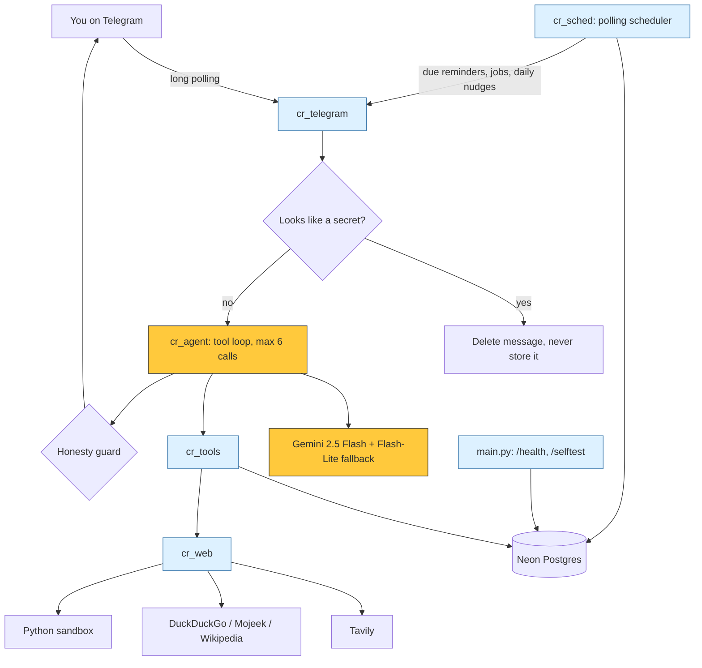

<div align="center">

# 🖍️ Crayon v1


**A personal assistant on Telegram with persistent memory, live web search, sandboxed code, reminders, tracked tasks and honest safety rails. Runs entirely on free tiers.**


[**Try the bot**](https://t.me/crayon_v1_bot) · [Features](#-what-crayon-can-do) · [Architecture](#-architecture) · [Safety](#-safety-rails) · [Endpoints](#-endpoints) · [Setup](#-setup) · [Limits](#-honest-limits)

</div>

---

## 🟡 What Crayon can do

Crayon lives in a Telegram chat at [`@crayon_v1_bot`](https://t.me/crayon_v1_bot), hosted at <https://crayon-v1.onrender.com/>. Everything below is live on the deployed bot.

| # | Capability | What it means in practice |
| :-: | :--- | :--- |
| 1 | 🧠 **Persistent memory** | Facts, preferences and projects are stored in Neon Postgres and recalled across chats and restarts. See and edit them with `/memory` and `/forget`. |
| 2 | 🔎 **Web search** | Current information through the Tavily API, with DuckDuckGo, Mojeek and Wikipedia as fallbacks. Can also open a public page and read its text. |
| 3 | 🧪 **Sandboxed code execution** | Exact math and data checks run in a Python sandbox with no internet, files or access to your data. |
| 4 | ⏰ **Reminders and scheduled jobs** | One-off or recurring reminders, plus self-running jobs that fire a prompt on schedule. Delivered by an in-process polling scheduler. |
| 5 | 📋 **Multi-day tracked tasks** | Tasks with subtasks and per-step status (`todo`, `doing`, `done`, `blocked`). Progress is injected into the conversation, and a daily check-in nudge follows up on open tasks. |
| 6 | 🛡️ **Safety rails** | Confirmation before irreversible actions, automatic deletion of messages that look like secrets, and an honesty guard that blocks unbacked "done" claims. |
| 7 | 🩺 **`/health` and `/selftest`** | A public health check and a token-protected end-to-end self test. |

### Chat commands

| Command | Does |
| :--- | :--- |
| `/start` | Greets you and registers your profile |
| `/help` | Lists what Crayon understands |
| `/memory` | Shows everything Crayon remembers about you |
| `/forget <key>` | Removes one remembered fact, then checks it is gone |
| `/delete_my_data confirm` | Permanently deletes your memory, notes, reminders and chat history |

Everything else is natural language: "remind me tomorrow at 9 to call the bank", "track my passport renewal as a task", "what's the latest on ...".

### Tools the model can call

| Group | Tools |
| :--- | :--- |
| Memory and notes | `remember`, `forget`, `save_note`, `list_notes` |
| Time and reminders | `get_time`, `set_reminder`, `schedule_job`, `list_reminders`, `cancel_reminder` |
| Tracked tasks | `create_task`, `list_tasks`, `update_step`, `close_task` |
| Web and compute | `web_search`, `read_url`, `run_python` |

Each tool is tagged with a risk level (safe, write or dangerous). Dangerous ones, such as `forget`, require an explicit YES first.

---

## 🔵 Architecture



### Stack

| Layer | Choice | Cost |
| :--- | :--- | :--- |
| Interface | Telegram Bot API, long polling | Free |
| Hosting | Render web service (free tier) | Free |
| Database | Neon Postgres (free tier) | Free |
| Model | Gemini 2.5 Flash, with `gemini-2.5-flash-lite` as fallback | Free tier |
| Search | Tavily API, then DuckDuckGo, Mojeek, Wikipedia | Free tier |

### Modules

| File | Role |
| :--- | :--- |
| `main.py` | Entry point: HTTP server for `/health` and `/selftest`, database setup, Telegram polling |
| `cr_telegram.py` | Telegram transport, command handling, per-user daily message cap, secret interception |
| `cr_agent.py` | Agent loop, system prompt, confirmation flow, honesty guard |
| `cr_llm.py` | Gemini client with model fallback |
| `cr_tools.py` | Tool registry and implementations (memory, reminders, tasks, web, code) |
| `cr_memory.py` | Facts, preferences, history and data deletion |
| `cr_db.py` | Neon Postgres access and schema (users, facts, messages, notes, reminders, tasks, subtasks, pending actions, audit log) |
| `cr_web.py` | Search with fallbacks, page reader, code sandbox |
| `cr_sched.py` | Background scheduler for reminders, jobs and daily task check-ins |
| `cr_safety.py` | Secret detection and log redaction |
| `cr_selftest.py` | End-to-end self test behind `/selftest` |
| `cr_config.py` | All settings, read from environment variables |

> [!NOTE]
> The repo also contains the original prototype layout (`core/`, `adapters/`, `tools/`, `db/schema.sql`, `notebooks/`). The deployed bot runs the `cr_*.py` modules above.

---

## 🧭 Design choices

**Polling, not webhooks.** Both the Telegram connection and the reminder scheduler poll. This was deliberate: it needs no public webhook registration and survives the free host sleeping and waking. A keep-warm ping keeps the Render service awake so the scheduler keeps running.

**Memory is explicit and inspectable.** Crayon stores what you ask it to remember. `/memory` shows it all, `/forget` removes one item, and `/delete_my_data confirm` wipes everything and verifies the result.

**Progress injection for tasks.** Open tasks and their step status are fed back into the model's context, so a multi-day task survives across chats without you repeating yourself. A check-in nudge (at most about one per task per day, during waking hours in your timezone) reminds you of active tasks that have gone quiet.

**Free by default.** Every component runs on a free tier. A per-user daily message cap protects those limits.

---

## 🛡️ Safety rails

| Rail | Behaviour |
| :--- | :--- |
| **Confirmation for irreversible actions** | Dangerous tools do not run on the model's say-so. Crayon stores a pending action and asks you to reply **YES** or **NO**. It expires after 10 minutes. |
| **Secret auto-deletion** | If a message looks like a password or API key, Crayon deletes it from the chat, does not save it, logs the event and tells you to rotate the secret if it was real. Known server secrets are also redacted from logs. |
| **Honesty guard** | The model may not claim something is saved, set or deleted unless a tool result in that same turn was verified. If it claims "done" without backing, the reply is replaced with a plain statement that nothing ran. |
| **Verified deletes** | `/forget` and `/delete_my_data` re-check the database and say so if anything remains. |
| **Untrusted web content** | Search snippets and page text are treated as data, never instructions. |
| **Bounded tool loop** | At most 6 tool calls per message. |
| **Audit log** | Confirmations, declines and blocked secrets are written to an audit table. |

---

## 🩺 Endpoints

| Endpoint | Auth | Returns |
| :--- | :--- | :--- |
| `GET /health` | none | JSON with `ok`, `version`, `db` (database reachable) and `mode` |
| `POST /selftest` | `Authorization: Bearer <CRAYON_ADMIN_TOKEN>` | Sends test messages through the real pipeline (live Gemini, live database) as a synthetic user, with nothing sent to Telegram. Can also trigger a scheduler tick and probe reminders or facts, then clean up. Returns `403` without the token. |

```bash
curl https://crayon-v1.onrender.com/health
```

---

## 🟢 Setup

You need a Telegram bot token, a Gemini API key and a Postgres connection string. Search works without Tavily but is better with it.

```bash
git clone https://github.com/itsppm76/crayon.git
cd crayon
python3 -m venv .venv
source .venv/bin/activate
pip install -r requirements.txt
```

Set these environment variables (a local `.env` works; never commit it):

| Variable | Required | Purpose |
| :--- | :-: | :--- |
| `TELEGRAM_BOT_TOKEN` | yes | Token from `@BotFather` |
| `GEMINI_API_KEY` | yes | Google AI Studio key |
| `DATABASE_URL` | yes | Neon Postgres connection string |
| `CRAYON_ADMIN_TOKEN` | for `/selftest` | Bearer token guarding `/selftest` |
| `TAVILY_API_KEY` | recommended | Tavily search; without it, fallbacks are used |
| `GEMINI_MODEL` | no | Default `gemini-2.5-flash` |
| `GEMINI_FALLBACK_MODELS` | no | Default `gemini-2.5-flash-lite` |
| `CRAYON_TZ` | no | Default timezone, default `Asia/Kolkata` |
| `CRAYON_MODE` | no | `polling` (default) |
| `CRAYON_PUBLIC_URL` | no | Public URL used for keep-warm |
| `CRAYON_DAILY_CAP` | no | Messages per user per day, default 80 |
| `CRAYON_HISTORY_TURNS` | no | Chat turns kept in context, default 14 |
| `CRAYON_VERIFY` | no | `1` (default) runs a one-pass self-check on factual answers; `0` turns it off |

Run it:

```bash
python main.py
```

**Deploy on Render:** create a free web service from this repo, set the variables above, use `python main.py` as the start command, and let Render supply `PORT`. Check `/health` once it is up.

---

## 🟠 Honest limits

- It is a single-user-scale project on free tiers. Free hosts sleep, free models rate-limit and Render's free instance can be slow on a cold start.
- Reminders are delivered by an in-process poller, so timing is close but not exact, and a long outage delays them.
- The code sandbox has no network or file access by design, so it cannot fetch data.
- Search quality depends on Tavily and its fallbacks; snippets can be wrong or stale.
- The honesty guard and secret detector are heuristics, not proofs. Rotate any secret that was pasted into a chat.
- Google testing-mode integration is live: per-user OAuth, direct Gmail/primary Calendar reads and exact-content review-first email drafts. Public verification and real email-send proof are pending.
- Test coverage in `tests/` is from the earlier prototype (see [`TEST_CHECKLIST.md`](TEST_CHECKLIST.md) for live checks) and mocks model responses. Live behaviour is checked through `/selftest` and the bot itself.

See [`KNOWN_LIMITATIONS.md`](KNOWN_LIMITATIONS.md) and [`ROADMAP.md`](ROADMAP.md) for older notes written before the milestones above; the sections in this README reflect the current deployed state.

---

## ⚪ License

MIT © 2026 Crayon contributors. Read [`LICENSE`](LICENSE).

<div align="center">

**Crayon Yellow `#FFC93C` · Charcoal `#2B2D31` · Slate `#6B7280`**

Small assistant. Honest status. Room to grow.

</div>

## Phase 2: practical agent skills

- `/goal <goal>`: saves a small plan, executes available tools, checks results, and reports remaining work. Maximum 12 calls with repeat/time limits. It cannot log into websites, buy things, or contact other people.
- Files up to 20,000,000 bytes: photos/PDF/audio/video use Gemini; text/code and common Office documents have bounded extraction; archives are listed without execution; unknown formats get honest receipts. Raw uploads are not kept, but up to 3,000 characters of analysis enter follow-up history. Large binary/video uploads use temporary Gemini Files with deletion attempts. Embedded instructions are data, not commands. Do not upload secrets.
- `/memory_review`: exact duplicate facts and evidence-backed preference suggestions for review. It never deletes facts or silently accepts inferred preferences.
- Message drafting: ask for a draft with the recipient and facts. Drafts are review-only; no external message is sent.
- `/proactive on|off`: optional daily check-in for a stale task or reminder due in the next two hours. Off by default.
- `/digest morning|evening|both|off`: optional task, reminder and recently completed task summaries. Off by default. Morning window 09-12, evening 18-21 local time.
- `/digest_now`: immediate summary. `/quiet_hours 21 9`: silence proactive messages and scheduled digests between those hours. Explicit reminders are not silenced.

Free-host delivery remains best-effort, not guaranteed at an exact minute. Quiet hours postpone a digest only while its delivery window remains open. Digests are deterministic and do not spend model quota.

The admin-only `/admin-test` form runs captured `/selftest` requests without exposing the admin token in a URL. Synthetic negative users are excluded from real scheduled senders. Captured tests accept negative synthetic IDs only. Authorized live owner-chat tests are separate and have actual Telegram transport.

Content-aware emoji reactions are chosen locally without model calls. Commands and YES/NO confirmations are skipped. Telegram reaction failures never block the reply.

## Google beta and group replies

- `/connect_google`, `/google_status`, `/disconnect_google`: each real private-chat user connects their own account. External/testing audience permits named testers only, lifetime user cap 100. Tokens can expire after seven days.
- `/gmail <query>`, `/gmail_read <ID>`, `/calendar`: direct reads, no mailbox/calendar results sent to Gemini or personal memory. Primary calendar only, next seven days.
- `/email_draft recipient | subject | body`: encrypted ten-minute draft. Review From, To, subject, body and no-CC/BCC/attachments before using the exact draft-specific `/email_send` command. `/email_cancel <ID>` removes a pending draft. No automatic send or uncertain-send retry. Real email sending remains untested.
- Slow text responses send timed progress notices. The shorter prompt keeps replies direct and plain.
- In groups, exact @crayon_v1_bot mentions route to a separate conversation-only answer path. No private memory, Google or personal tools. Untagged messages are ignored; group context is not stored in personal memory. BotFather privacy is ENABLED and says username mentions are delivered. Real group delivery remains untested.
- Privacy: https://crayon-v1.onrender.com/privacy. Terms: https://crayon-v1.onrender.com/terms. Public Google verification and any restricted-scope security assessment are pending, not approved certification. No paid assessment has been initiated.
